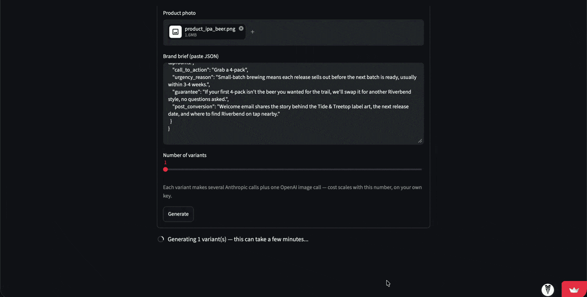

<!-- SKELETON — fill on Thursday, Week 2. Delete every comment block as you fill it. -->

# Ad Creative Generator

<!-- One sentence: what goes in, what comes out. Write it last, from the "Goal" line in the project note. -->

<!-- Demo GIF goes directly under the title — it is the first thing anyone looks at:
      -->

<!-- Live demo · Repo owner line, e.g.:
     **Try it:** [live link] · Built solo, September 2026 -->

## The problem

<!-- 2–3 sentences. Why ad creative at volume is hard: teams need many variants to test, hand-made
     variants are slow, and generated ones drift off-brand. Say who this is for. -->

## How it works

<!-- A small pipeline diagram in a code block (brief -> copy variants -> images -> judge -> scored output),
     then 3–5 numbered steps naming the actual models, endpoints and files. -->

## Evaluation

<!-- THE SECTION THAT MATTERS MOST — most portfolio projects have no numbers.
     - How the judge works and the 5 rubric criteria.
     - How it was measured: 50 variants, labelled by me, pass/fail per criterion.
     - The agreement table from the project note, v1 vs v2 after one prompt fix.
     - Define the metric and state its range before quoting any number.
     - Cost and time per 20 variants. -->

## Results

<!-- 3–4 bullets with real numbers: variants per run, agreement %, cost, time.
     Add 1–2 example outputs as images if they help. No adjectives without a number behind them. -->

## Stack

<!-- One line: Python, FastAPI, Pydantic, [image model/API], [LLM], Streamlit, Docker, GitHub Actions. -->

## How to run

<!-- Copy-pasteable. Clone, .env with the API keys needed (names only, never values),
     pip install / docker compose up, the URL it starts on. Keep it under 6 lines. -->

## Known limitations and next steps

<!-- 3–4 honest bullets: what it does not handle yet, and what you would build next.
     This reads as maturity, not weakness — keep it neutral, no apologies. -->
